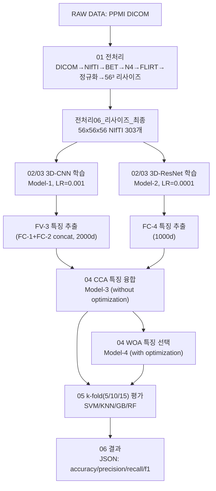

# Brain_Tensor — PPMI T2 MRI 기반 파킨슨병 진단 논문 재현

PPMI(Parkinson's Progression Markers Initiative) T2-weighted MRI 데이터를 이용해
3D-CNN·3D-ResNet 특징 추출, CCA 특징 융합, WOA(Whale Optimization Algorithm) 특징
선택, 다중 분류기 평가로 이어지는 논문의 파이프라인을 최대한 동일하게 재현하는
프로젝트입니다. 본 README는 저장소에 실제로 존재하는 코드와 문서만을 근거로
작성되었습니다.

## 목차

- [프로젝트 소개](#프로젝트-소개)
- [프로젝트 목표](#프로젝트-목표)
- [연구 배경](#연구-배경)
- [사용한 논문](#사용한-논문)
- [데이터셋 정보](#데이터셋-정보)
- [프로젝트 구조](#프로젝트-구조)
  - [전처리 (Preprocessing)](#전처리-preprocessing)
  - [Feature Engineering](#feature-engineering)
  - [모델 (Model)](#모델-model)
  - [학습 (Training)](#학습-training)
  - [추론 (Inference)](#추론-inference)
  - [결과 (Result)](#결과-result)
- [논문과 실제 구현의 차이점](#논문과-실제-구현의-차이점)
- [폴더 구조 설명](#폴더-구조-설명)
- [생성되는 결과 파일 설명](#생성되는-결과-파일-설명)
- [Requirements](#requirements)
- [설치 방법](#설치-방법)
- [실행 방법](#실행-방법)
- [프로젝트 Workflow](#프로젝트-workflow)
- [참고 문헌 (References)](#참고-문헌-references)
- [라이선스 (License)](#라이선스-license)

## 프로젝트 소개

이 저장소는 PPMI 코호트의 T2 강조 MRI 303례(Control 110 / Prodromal 58 / PD 135)를
대상으로, 논문에 기술된 전처리·모델링 절차를 재현하는 코드와 문서를 담고 있습니다.
DICOM 원본 변환부터 최종 분류기 평가까지 전 과정이 번호가 매겨진 폴더에 실행 순서
그대로 정리되어 있습니다.

## 프로젝트 목표

- 이 저장소의 raw data만 사용하여 전처리와 모델링을 수행하고, 논문의 실험 결과를
  최대한 동일하게 재현합니다.
- 전처리 실행 순서는 논문 Method를 우선 기준으로 하며, 기존 참고 코드와 다른 경우
  논문을 우선 적용하고 차이점을 기록합니다.
- 모델링도 논문의 실험 설정(데이터 분할, 하이퍼파라미터, 평가 지표)을 최대한
  동일하게 재현하는 것을 목표로 합니다.
- 논문에 명시되지 않아 자체적으로 결정한 모든 값은 반드시 근거를 남깁니다
  (`03_Model_Training/DEVIATIONS.md`).

## 연구 배경

파킨슨병(Parkinson's disease, PD)은 임상 척도만으로는 조기 진단이 어려워, MRI 같은
비침습적 영상 바이오마커를 이용한 보조 진단 연구가 활발합니다. 논문은 T2 강조 MRI에서
3D-CNN과 3D-ResNet 두 개의 딥러닝 백본으로 특징을 각각 추출한 뒤, CCA로 두 특징을
융합하고 WOA로 최적 특징 서브셋을 선택해, 전통적 분류기(SVM/KNN/GB/RF)로 Control /
Prodromal / PD 3-class를 분류하는 하이브리드 파이프라인을 제안합니다. 이 저장소는
해당 파이프라인을 PPMI 공개 데이터로 그대로 재구현하는 것을 목표로 합니다.

## 사용한 논문

> Priyadharshini, S. et al. "Automated Parkinson's disease diagnosis using T2-weighted
> MRI with hybrid deep learning and whale optimization." *Scientific Reports* 14, 23394
> (2024). https://doi.org/10.1038/s41598-024-74405-5

`07_Document/주논문_nature.pdf`에 원문 PDF가 포함되어 있으며, 그 외 관련 참고문헌
PDF 4종도 같은 폴더에 있습니다.

## 데이터셋 정보

| 항목 | 내용 |
|---|---|
| 출처 | PPMI (Parkinson's Progression Markers Initiative) |
| 시퀀스 | T2-weighted MRI (FLAIR 계열 제외, `01_Preprocessing/303_rerun_wsl_README.md`) |
| 전체 표본 | 303명 |
| Control | 110명 |
| Prodromal | 58명 |
| Parkinson's disease (PD) | 135명 |
| 최종 영상 규격 | 3D NIfTI(.nii.gz), 56×56×56 voxel, MNI152 정합 |
| 메타데이터 | `01_Preprocessing/data.csv`, `data_final_303.csv` |

`data_final_303.csv`는 `sample_id, Subject, Image Data ID, Group, label, Sex, Age,
Visit, Description, Acq Date, raw_dicom_dir, dicom_file_count` 열로 구성되며,
`label`은 Control=0, Prodromal=1, PD=2 입니다. 원본 DICOM(`RAW DATA/`)과 전처리
중간 산출물(`01_Preprocessing/전처리01_원본변환`~`전처리05_정규화`)은 용량 문제로
`.gitignore`에 의해 이 저장소에는 포함되어 있지 않고, 최종 결과(`전처리06_리사이즈_최종`)
역시 로컬 전용입니다. 저장소에는 코드·CSV 메타데이터·QC 이미지·문서만 포함됩니다.

## 프로젝트 구조

### 전처리 (Preprocessing)

`01_Preprocessing/`에 위치하며 6단계로 구성됩니다 (논문 Method 순서 우선 적용).

1. DICOM → 3D NIfTI 변환
2. FSL BET 뇌 추출 (두개골 제거)
3. ANTs N4 bias-field correction
4. FSL FLIRT 12-DOF affine, MNI152 표준 공간 정합
5. 0이 아닌 뇌 voxel z-score 정규화 후 [-5, 5] 클리핑
6. 56×56×56 리사이즈

핵심 스크립트는 `01_Preprocessing/스크립트/preparing.py`(개별 전처리 함수),
`run_staged_preprocessing.py`(단계별 배치 실행/로그 기록)이며, 실행 로그는
`01_Preprocessing/로그_QC/preprocessing_log.csv`에 기록됩니다. 데이터 분할은 반드시
`Subject` 단위로 먼저 수행한 뒤 train 세트에만 증강을 적용해야 데이터 누출을 막을 수
있습니다(자세한 내용은 `01_Preprocessing/README.md`).

### Feature Engineering

`04_Feature_Engineering/`에 위치하며 두 단계로 구성됩니다.

- `cca_feature_fusion.py` — CCA(Canonical Correlation Analysis)로 3D-CNN의 FV-3(2000차원)와
  3D-ResNet의 FC-4(1000차원)를 융합. `sklearn.cross_decomposition.CCA` 사용, 성분 수는
  `min(n_samples-1, 100)`을 기본값으로 자동 산정.
- `woa_feature_selection.py` — WOA(Whale Optimization Algorithm)로 융합된 특징에서
  이진 마스크 기반 최적 서브셋을 선택. Encircling prey, bubble-net(spiral) attack,
  exploration 세 단계를 포함하며 fitness는 `alpha*KNN오류율 + (1-alpha)*선택비율`.

### 모델 (Model)

`02_Model_Definition/models.py`에 두 백본이 정의되어 있습니다.

| 모델 | 구조 요약 | 출력 특징 |
|---|---|---|
| `CNN3D` (Model-1, 3D-CNN) | conv 7층(32→64→128→256→512→1024→512→256) + MaxPool 3회 + BatchNorm 3회, FC-1/FC-2 각 1000 | FV-3 (concat, 2000차원) |
| `ResNet3D` (Model-2, 3D-ResNet) | stem conv 2층(1→32→64) + Residual Block 5개(각 3 Residual Unit, 채널 64→128→256→512→512) + AdaptiveAvgPool, FC-4 | FC-4 (1000차원) |

두 백본의 특징을 CCA로 융합하면 Model-3(without optimization), WOA로 최적화하면
Model-4(with optimization)가 되며, 이 두 모델을 SVM/KNN/GB/RF로 분류·평가합니다
(`05_Model_Evaluation/ml_classifiers_kfold_eval.py`).

### 학습 (Training)

`03_Model_Training/`에 위치합니다.

- `dataset.py` — `PPMIT2Dataset`(56³ NIfTI 로더), `augment_volume_3d`(회전/flip/스케일/노이즈
  증강, Train 세트 전용), `get_holdout_split`(70/15/15 피험자 단위 분할, 3D-CNN/3D-ResNet
  자체 학습용), `get_kfold_splits`(k=5/10/15 피험자 단위 stratified k-fold, Model-3/4 평가용).
  Data Augmentation은 한 차례 제외되었다가(2026-07-06 1차), Ablation Base 모델 실측 결과
  심각한 과적합(Train 99% vs Test 37%)이 확인되어 다시 도입됨(2026-07-06 2차).
- `train.py` — 전체 파이프라인 오케스트레이션. 3D-CNN 학습(LR=0.001) → 3D-ResNet
  학습(LR=0.0001) → 특징 추출(FV-3, FC-4) → CCA 융합 → WOA 최적화 → k-fold(5/10/15)
  평가까지 한 번의 실행으로 수행합니다. Optimizer=Adam, weight_decay=0.0001, Epoch=30
  (논문 Table 5). 배치는 `--effective_batch_size`(기본 64, Table 3 Study2 Variant3 확인값)를
  `--batch_size`(기본 8, GPU에 실제로 올라가는 물리 배치)와 gradient accumulation으로
  재현합니다(예: 물리 8 × 누적 8회 = 유효 64). `--smoke_test` 플래그로 데이터 수/epoch/WOA
  반복만 축소한 경량 검증 실행도 지원합니다(모델 구조 자체는 축소하지 않음).
- `checkpoints/`, `training_logs/` — 학습된 가중치·로그 저장 위치(현재 비어있음, `.gitignore`
  대상).

### 추론 (Inference)

별도의 추론 전용 스크립트는 없습니다. 이 파이프라인은 k-fold 교차검증으로 평가하므로,
`05_Model_Evaluation/ml_classifiers_kfold_eval.py`의 `kfold_evaluate()`가 각 fold마다
분류기를 학습(`fit`)한 직후 곧바로 해당 fold의 테스트 데이터에 추론(`predict`)하고
지표를 계산하는 방식으로 추론과 평가를 한 함수 안에서 함께 수행합니다.

### 결과 (Result)

`06_Result/`는 학습·평가 실행 결과(JSON, 성능표 등)를 저장하기 위해 예약된 폴더이며
현재는 비어 있습니다. GPU 환경에서 `train.py`를 실제로 실행하면 `smoke_test_result.json`
또는 `full_run_result.json` 형태의 결과 파일이 생성됩니다(실행 위치 저장, 아직 이
폴더로 자동 이동되지는 않음).

## 논문과 실제 구현의 차이점

**주의**: 아래 표는 GPU 학습을 실행해서 나온 "성능 결과 비교"가 아니라, 코드를 작성하는
시점에 이미 확정된 "설계값 비교"입니다. 논문이 값을 명시하지 않은 항목은 코드 작성 시
프로젝트가 자체적으로 값을 정해야 했고, 그 결정과 근거를 `03_Model_Training/DEVIATIONS.md`에
전부 기록해 두었습니다. 아래는 그중 주요 항목만 요약한 것이며, **"논문" 열은 논문
원문에 쓰인 내용**, **"실제 구현" 열은 이 저장소의 코드(`models.py`, `dataset.py` 등)에
실제로 작성된 값**입니다.

| 구성 요소 | 항목 | 논문 (원문 내용) | 실제 구현 (코드에 작성된 값) | 차이가 발생한 이유 |
|---|---|---|---|---|
| 3D-CNN | Conv Stride/Padding | 값 자체가 없음 (수치 미기재) | stride=1, padding=1 (SAME) | Figure 2의 단계별 출력 크기가 pool 전까지 불변으로 표기되어, 이를 만족하는 유일한 표준 조합을 채택 |
| 3D-CNN | Flatten 차원 | 12544로 명시하나, 직전 conv 출력(7×7×7×256=87808)과 산술이 맞지 않음 | AdaptiveAvgPool3d로 depth축만 1로 축소 → 7×7×256=12544 | 논문에 적힌 최종 수치(12544)를 재현 목표로 우선 채택 |
| 3D-CNN | FV-3 결합 방식 | 본문 Eq.2는 elementwise max(결과 1000차원)로 서술하나, Figure 1 라벨은 "FV-3 ×2000" | concatenation으로 결합(2000차원) | 최종 차원이 Figure 1의 2000과 일치하려면 concatenation이어야 함 |
| 3D-ResNet | 채널 폭(필터 수) | Figure 3에 수치가 전혀 없음 | 64→128→256→512→512 | 논문에 근거가 없어 표준 ResNet 채널 더블링 관행을 자체 적용 |
| CCA | 성분 개수(n_components) | 수치 미기재 | `min(n_samples-1, 100)` | 학습 샘플 수·두 특징 차원(2000, 1000)에 안전하게 맞춘 자체 결정 |
| WOA | fitness 가중치 alpha | 수치 미기재 | 0.99 | WOA 특징선택 문헌에서 흔히 쓰는 값(정확도에 절대 가중치) |
| 분류기 | SVM/KNN/GB/RF 하이퍼파라미터 | 전혀 언급 없음 | scikit-learn 기본값 | 논문에 근거가 없어 라이브러리 기본값을 그대로 사용 |
| 학습 | 3D-CNN 배치 크기 | **명시됨**: Table 3(Study 2, Variant 3, 3D-CNN 최고 성능 Accuracy 93.41%)가 Batch=64 사용 | 유효 배치 64 (물리 배치 8 × gradient accumulation 8회) | 56³ 입력에 채널 최대 1024까지 쓰는 구조라 배치 64를 그대로 GPU에 올리면 VRAM이 크게 부족할 수 있어, 물리 배치를 낮추고 누적으로 논문과 동일한 유효 배치를 재현 |
| 학습 | Grid Search 재실행 여부 | Grid Search로 최적 설정을 찾았다고 서술 | 그리드 서치를 다시 돌리지 않고, 논문이 보고한 최종 채택값(Adam, LR 0.001/0.0001)을 직접 사용 | 그리드 서치 전체 재실행은 계산 비용이 지나치게 크고, 논문이 이미 찾아낸 최적값을 재현하는 것이 프로젝트 목표에 부합 |

전처리 단계별 비교는 `07_Document/전처리비교_논문_vs_실제.xlsx`, 전체 8단계
파이프라인 비교는 `07_Document/파이프라인비교_논문_vs_실제.xlsx`에 정리되어 있습니다.

> 참고: 위 표는 어디까지나 "코드에 무엇을 작성했는가"의 비교입니다. "그 코드를 실제
> GPU로 학습시켰을 때 논문과 같은 정확도가 나오는가"는 아직 실행 전이라 이 표에
> 포함되어 있지 않습니다. 학습이 끝나면 `06_Result/`에 정확도 비교가 별도로 추가될
> 예정입니다.

## 폴더 구조 설명

```
Brain_Tensor/
├── 00_RawData/              원본 데이터 안내 (실제 원본은 RAW DATA/, 저장소 미포함)
├── 01_Preprocessing/         전처리 6단계 코드·로그·메타데이터 CSV
├── 02_Model_Definition/      3D-CNN, 3D-ResNet 구조 정의 (models.py)
├── 03_Model_Training/        데이터 분할·증강, 학습 오케스트레이션, 검증 문서
├── 04_Feature_Engineering/   CCA 융합, WOA 특징 선택
├── 05_Model_Evaluation/      SVM/KNN/GB/RF 학습·추론·k-fold 평가
├── 06_Result/                실행 결과 저장 위치 (현재 비어있음)
├── 07_Document/              논문, 참고문헌, 비교 문서, 아키텍처 분석
├── 08_Visualization/         전처리 QC 시각자료
├── RAW DATA/                 원본 DICOM (저장소 미포함, 로컬 전용)
└── 지난파일/                  이전 버전 아카이브 (저장소 미포함, 로컬 전용)
```

폴더 번호는 실제 실행 순서(00→08)에 맞춰 부여되어 있습니다. `02_Model_Definition`과
`03_Model_Training`을 분리한 이유는 "구조 정의"(재사용해도 바뀌지 않는 코드)와
"학습 실행"(실행할 때마다 달라지는 로그·체크포인트)을 구분하기 위함입니다.

## 생성되는 결과 파일 설명

| 파일 | 생성 위치/시점 | 내용 |
|---|---|---|
| `preprocessing_log.csv` | 전처리 실행 시 | 303개 표본의 전처리 상태, 오류 메시지, 단계별 처리 시간 |
| `06_resized_manifest_verification.csv` | 전처리 검증 시 | 최종 리사이즈 결과 303개의 shape·무결성 검증 로그 |
| `smoke_test_result.json` / `full_run_result.json` | `train.py` 실행 시 | 백본 학습 이력(loss/acc), 특징 shape, WOA 선택 특징 수, k-fold 평가 지표 |
| `report_cnn.json` / `report_resnet.json` | `smoke_test.py` 실행 시 | 단일 배치 forward/loss/optimizer step 결과 (CPU 동작 검증용) |
| `checkpoints/*.pth` | 학습 완료 후 (현재 없음) | 학습된 3D-CNN/3D-ResNet 가중치 |

## Requirements

### Python 버전

`01_Preprocessing/스크립트/requirements.txt` 상단 주석에 명시된 전처리 환경은
**Python 3.12.3** 입니다.

### 전처리 의존성 (저장소에 명시된 `requirements.txt` 기준)

```
dicom2nifti==2.6.2
nibabel==5.4.2
numpy==2.4.6
pydicom==3.0.2
scipy==1.17.1
```

전처리를 처음부터 재실행하려면 pip 설치가 불가능한 외부 도구도 별도로 설치해야
합니다: **FSL 6.0**(BET, FLIRT), **ANTs 2.6.5**(N4BiasFieldCorrection),
**dcm2niix v1.0.20260416**(DICOM 변환 대체 경로).

### 모델링 의존성 (코드 임포트 기준, 별도 requirements 파일 없음)

`02_Model_Definition/`~`05_Model_Evaluation/` 코드가 실제로 import하는 라이브러리는
다음과 같습니다. 이 목록은 코드를 직접 확인해 만든 것이며, 저장소에는 이를 고정하는
requirements 파일이 아직 없습니다(아래 [추가 제안](#추가-제안) 참고).

```
torch            # nn.Conv3d/BatchNorm3d/MaxPool3d, autograd, optim.Adam
scikit-learn      # CCA, KNeighborsClassifier, SVC, GradientBoosting/RandomForest, StratifiedKFold
numpy
scipy             # scipy.ndimage.rotate (증강)
nibabel           # NIfTI 로딩
```

- **PyTorch 버전**: 저장소 코드에 버전이 고정되어 있지 않습니다. CPU 환경에서의
  코드 동작 검증(스모크 테스트, `DEVIATIONS.md` 7절)에는 Ubuntu 22.04 apt 패키지의
  **PyTorch 1.8.1(CPU 전용)**을 사용했으나, 이는 검증용일 뿐 학습 전용 버전으로
  권장하지 않습니다. `train.py`는 RTX 4060 GPU 환경(사용자 로컬 PC) 실행을 전제로
  작성되었으므로, 실제 학습 시에는 보유 GPU/드라이버에 맞는 CUDA 빌드의 최신 안정
  버전(예: PyTorch 2.x + CUDA 12.x)을 설치하는 것을 권장합니다.
- **CUDA 버전**: 저장소에 명시되어 있지 않습니다. `nvidia-smi`로 드라이버가 지원하는
  최대 CUDA 버전을 확인한 뒤 그에 맞는 PyTorch 빌드를 설치하십시오.
- **MONAI, TorchIO, SimpleITK, OpenCV, pandas, matplotlib**: 현재 코드 어디에서도
  import되지 않습니다. 이 저장소는 nibabel(NIfTI 입출력)과 scipy.ndimage(증강)만으로
  전처리 이후 파이프라인을 구현하고 있어, 위 라이브러리들은 설치가 필수는 아닙니다.

### 설치 방법

```bash
git clone https://github.com/yjson0509maymay/BRAINTENSOR.git
cd BRAINTENSOR

python -m venv .venv
source .venv/bin/activate   # Linux/macOS
.venv\Scripts\activate      # Windows

# 전처리 환경
pip install -r 01_Preprocessing/스크립트/requirements.txt

# 모델링 환경 (저장소에 고정된 requirements 파일이 없어 직접 설치)
pip install torch scikit-learn   # PyTorch는 본인 GPU/CUDA에 맞는 빌드 선택 권장
```

## 실행 방법

1. **데이터 준비**: PPMI 원본 DICOM을 준비하고 `01_Preprocessing/data.csv`(또는
   `data_final_303.csv`)의 `raw_dicom_dir` 열이 실제 경로를 가리키는지 확인합니다.
2. **전처리**: `01_Preprocessing/스크립트/run_staged_preprocessing.py`를 실행해
   DICOM→NIfTI→BET→N4→FLIRT→정규화→56³ 리사이즈 6단계를 순서대로 수행합니다. 최종
   결과는 `전처리06_리사이즈_최종/`에 303개 NIfTI로 생성됩니다.
3. **학습 + Feature Engineering + 추론/평가 (한 번에 실행)**:
   ```bash
   python 03_Model_Training/train.py \
     --csv_path 01_Preprocessing/data_final_303.csv \
     --image_dir 01_Preprocessing/전처리06_리사이즈_최종
   ```
   이 한 번의 실행이 3D-CNN 학습 → 3D-ResNet 학습 → 특징 추출 → CCA 융합 →
   WOA 최적화 → k-fold(5/10/15) 평가까지 전부 수행합니다. GPU가 없거나 코드 동작만
   빠르게 확인하려면 `--smoke_test` 플래그를 추가하세요(샘플 수·epoch·WOA 반복만
   축소, 모델 구조는 그대로).
4. **개별 모듈 단위 확인(선택)**: `dataset.py`, `cca_feature_fusion.py`,
   `woa_feature_selection.py`, `ml_classifiers_kfold_eval.py`는 각각 `__main__` 블록에
   자체 검증 예제를 포함하고 있어 `python <파일명>.py`로 단독 실행해 확인할 수 있습니다.
5. **CPU 전용 경량 검증(선택)**: `python 03_Model_Training/smoke_test.py --model cnn`
   (또는 `--model resnet`)으로 forward/loss/optimizer step만 단독 검증할 수 있습니다.
6. **결과 확인**: 실행이 끝나면 `smoke_test_result.json` 또는 `full_run_result.json`에
   백본 학습 이력, 특징 shape, WOA 선택 특징 수, k-fold 평가 지표(accuracy/precision/
   recall/f1)가 저장됩니다.

## 프로젝트 Workflow



## 참고 문헌 (References)

- Priyadharshini, S. et al. *Scientific Reports* 14, 23394 (2024).
  https://doi.org/10.1038/s41598-024-74405-5 — `07_Document/주논문_nature.pdf`
- `07_Document/1_0`, `1_1` — 뇌추출·공간정합·정규화·데이터증강이 모델 일반화 성능
  향상 및 해부학적 편차 감소에 미치는 영향 관련 문헌
- `07_Document/2_` — 두개골 제거 및 필드 보정이 MRI 영상 품질(외부 조직 제거)에
  미치는 영향 관련 문헌
- `07_Document/3_` — T2 강조 영상의 피질 구조적 변화 분석(데이터 선택 근거이며
  전처리 기법 자체의 출처는 아님)

## 라이선스 (License)

이 저장소에는 아직 LICENSE 파일이 없습니다. 참조 논문(Scientific Reports)의 코드나
데이터 자체를 재배포하는 것이 아니라 PPMI 공개 데이터를 별도 이용약관 하에 사용해
직접 재구현한 것이므로, 이 저장소의 코드에 대한 라이선스는 저장소 소유자가 별도로
정해야 합니다. PPMI 데이터는 자체 Data Use Agreement를 따릅니다(PPMI 웹사이트 참고).

## 추가 제안

README 작성을 위해 저장소를 검토하며 확인한, 개선하면 좋을 부분입니다.

**누락된 문서**
- `LICENSE` 파일이 없습니다. 코드를 공개할 계획이면 라이선스(MIT, Apache-2.0 등)를
  명시하는 것을 권장합니다.
- `CONTRIBUTING.md`, 이슈/PR 템플릿이 없어 팀원 외 협업자가 참여하기 어렵습니다.
- GPU 환경에서 실제 학습을 완료한 뒤의 결과 리포트(정확도표, confusion matrix 등)가
  아직 없습니다. `06_Result/`가 채워지면 논문 Table 4/6과의 정량 비교표를 추가하면
  좋습니다.

**추가하면 좋은 문서**
- 저장소 루트에 이 README 외에, `03_Model_Training/DEVIATIONS.md`처럼 전처리 단계의
  결정 사항만 모은 요약본이 있으면 좋습니다(현재는 `07_Document`의 엑셀 두 개에
  분산되어 있음).

**`requirements.txt` 보완 사항**
- 현재 `requirements.txt`는 `01_Preprocessing/스크립트/` 안에만 있고 전처리 라이브러리만
  다룹니다. `torch`, `scikit-learn`(모델링에서 실제 사용)이 어떤 requirements 파일에도
  없어, 저장소를 새로 clone한 사람이 무엇을 설치해야 하는지 코드를 직접 열어봐야 알 수
  있습니다. 저장소 루트에 `requirements.txt`(또는 `requirements-modeling.txt`)를 추가해
  `torch`, `scikit-learn` 버전을 명시하는 것을 권장합니다.
- PyTorch는 CUDA 버전에 따라 설치 커맨드가 달라지므로, 버전 고정보다는 "권장 설치
  커맨드"를 문서로 남기는 편이 낫습니다.

**`.gitignore` 개선 사항**
- 현재 `.gitignore`는 실제 이미지·아카이브·로그 폴더를 잘 제외하고 있어 저장소 크기가
  49개 파일로 적절히 유지되고 있습니다. 다만 `*.pth`, `*.pt`(모델 가중치 확장자)와
  `*.json`(결과 파일, 원한다면) 패턴을 명시적으로 추가해두면 향후 `06_Result/`나
  실행 위치에 실수로 생성되는 대용량/개인 결과 파일이 저장소 밖에서도 실수로
  커밋되는 일을 막을 수 있습니다.

**폴더 구조 개선 사항**
- `02_Model_Definition`~`05_Model_Evaluation`이 서로 다른 폴더에 있어 `sys.path`를
  코드에서 직접 조작해 임포트합니다(`train.py`, `smoke_test.py` 상단 참고). 장기적으로는
  이 4개 폴더를 하나의 Python 패키지(예: `src/brain_tensor/`)로 묶고
  `pip install -e .`로 설치하는 형태가 임포트 안정성 측면에서 더 견고합니다.

**GitHub 공개용으로 개선하면 좋을 부분**
- README에 실제 실행 결과 스크린샷/성능표가 아직 없어, 지금은 "코드가 있다"는 것은
  보여주지만 "논문 재현이 어느 정도 성공했는지"는 보여주지 못합니다. GPU 학습 완료
  후 결과를 이 README나 `06_Result`에 추가하면 저장소의 완성도가 크게 올라갑니다.
- PPMI 데이터는 자체 신청 절차가 필요한 통제 데이터이므로, README에 "이 데이터를
  얻으려면 PPMI(ppmi-info.org)에 별도로 데이터 사용 신청을 해야 한다"는 안내를
  추가하면 외부 방문자의 혼선을 줄일 수 있습니다.
